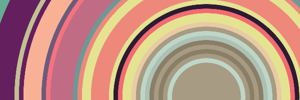
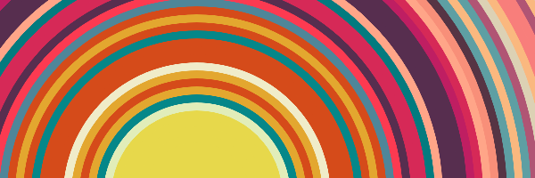

# Outzone

zone out by making colours change (put on music!) -- https://wcarss.ca/outzone

## What?

Hit the arrow keys to make colors emanate from a bouncing circle. Hit space to
change palettes.

## Motivation

This is probably strange, but I like to have something mildly interactive that
I can make do things in time to music. When I'm working, I sometimes hit a
wall or need a moment to gather focus, and something like this is a lot less
likely to lead to a distraction than browsing reddit!

## Authorship & License

Wyatt Carss, October 2021
MIT License
